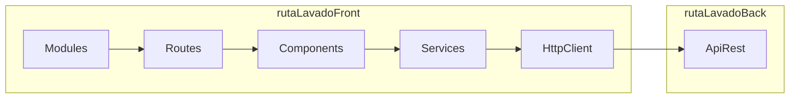

# 3981-arcangel-angular-js

Aplicación front-end contenerizada para ruta lavado cafe

## Introducción

Solución para monitorear y tener la trazabilidad de la gestion de proyectos en Softcaribbean.

## Tecnologías empleadas

This project was generated with [Angular CLI](https://github.com/angular/angular-cli) version 12..1.

- Para la construcción de la aplicación frontend se uso como framework [**Angular version 12.2.6.**](https://github.com/angular/angular-cli)
- Gestor de paquetes usado es **npm v12.16.2**
- La imagen base para la construción del dockerfile se uso **node:12**

## Librerías usadas

Las librerias usadas para el proyecto son:

- Angular Material
- flex-layout
- ng-block-ui
- sweetalert2
- Amplify

## Arquitectura de la aplicación



## Arquitectura de Ambientes

## Pruebas automatizadas (En caso de que aplique)

Pendiente

## Imágenes

## Ejemplos de código

### Development server

Run `ng serve` for a dev server. Navigate to `http://localhost:4200/`. The app will automatically reload if you change any of the source files.

### Code scaffolding

Run `ng generate component component-name` to generate a new component. You can also use `ng generate directive|pipe|service|class|guard|interface|enum|module`.

### Unit Test

Para la ejecución de pruebas unitarias y generación de reporte de covertura ejecutar el comando `ng test --no-watch --code-coverage` ubicación de generación: coverage\ruta-lavado-cafe-front

### Build Production

Run `npm run build` to build the project. The build artifacts will be stored in the `dist/` directory.

### Build QA

Run `npm run build:qa` to build the project. The build artifacts will be stored in the `dist/` directory.

## Instalación

### Instalación local para desarrollo

1.  Instalar **[npm](https://nodejs.org/es/)**
2.  Instalar angular desde CMD o Terminal`npm install -g @angular/cli@latest`
3.  Descargar el proyecto
4.  Desde CMD o Terminal ubicarse en la carpeta del proyecto e instalar las dependencias ejecutando `npm i`
5.  Modificar el archivo ubicado en la ruta `src/environments/environment.ts` reemplazando url_api por la ruta donde se encuentra desplegado el API REST:

```
<!-- Archivo Original -->
export  const  environment  = {
	production:  true,
	url_api:  'example',
};
```

```
<!-- Archivo Modificado -->
export const environment = {
 production: false,
 url_api : 'http://localhost:8081/api',
 USER_POOL_REGION: 'us-east-1',
 USER_POOL_ID: 'us-east-1_m0IZjHKFE',
 USER_POOL_WEB_CLIENT_ID : '5o974pl0sinkvhpbimu2mm6sag',
 USER_POOL_DOMAIN: 'softcaribbean.auth.us-east-1.amazoncognito.com',
 USER_POOL_REDIRECT_SIGN_IN: 'http://localhost:4200/home',
 USER_POOL_REDIRECT_SIGN_OUT: 'http://localhost:4200/login'
};
```

6.  Existen archivos de configuración para cada uno de los ambientes `src/environments/environment.prod.ts`, `src/environments/environment.qa.ts`, `src/environments/environment.staging.ts`.

7.  Ejecutar el comando `ng serve --o` ubicado en la carpeta del proyecto, esto abrirar en el navegador por defecto la aplicación.

## Errores conocidos

## Autores

Softcaribbean S.A.
